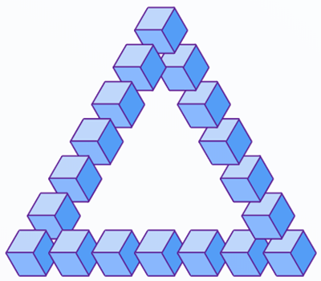

penrose-triangle-js
===================

Drawing inspiration from the [Penrose triangle](https://en.wikipedia.org/wiki/Penrose_triangle), 
this project provides an optical illusion consisting of several cubes that move along an impossible triangular path.



## Getting started

Options to add `penrose-triangle-js` to your project:
* Install with [npm](https://npmjs.org): `npm install penrose-triangle-js`
* [Download the latest release](https://github.com/llop/penrose-triangle-js/archive/master.zip)
* Clone the repo: `git clone https://github.com/llop/penrose-triangle-js.git`

A `canvas` is required to display the animation.

```html
<canvas id='penrose-canvas' width='400' height='350'></canvas>
```

To use `penrose-triangle-js`, just import the script and start the animation.

```html
<script src='penrose-triangle.js'></script>
<script>
  // start the animation when the page loads
  window.onload = () => {
    const canvas = document.getElementById('penrose-canvas');
    const penroseTriangle = new PenroseTrinagle(canvas);
    penroseTriangle.start();
  };
</script>
```

## Advanced use

It is possible to customize the animation by providing an `options` object to the `PenroseTriangle` constructor. 
The default options are:

```javascript
{
  triangleEdge: 300,        // length of triangle's edge in pixels
  cubeEdge: 30,             // length of cube's edge in pixels
  cubesPerTriangleEdge: 6,  // # of cubes per triangle edge
  padding: [ 50.5, 0.5 ],   // top and left padding in pixels
  loopFrames: 100,          // # of frames per loop
  lineWidth: 3,             // cube line's width in pixels
  lineColor: '#0041a3',     // cube line's color
  cubeColors: [             // colors for the cube's visible faces
    '#4f9bf7', 
    '#c0d8fc', 
    '#87b7ff' 
  ]
}
```

## License

`penrose-triangle-js` is released under the MIT License. See [LICENSE](LICENSE) for details.